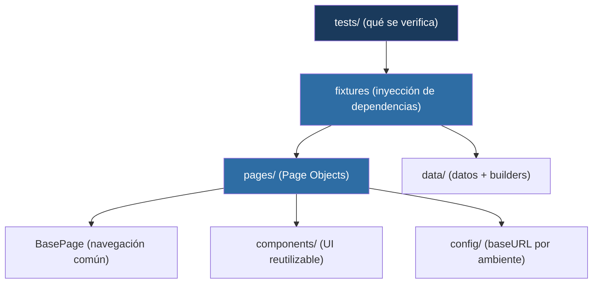
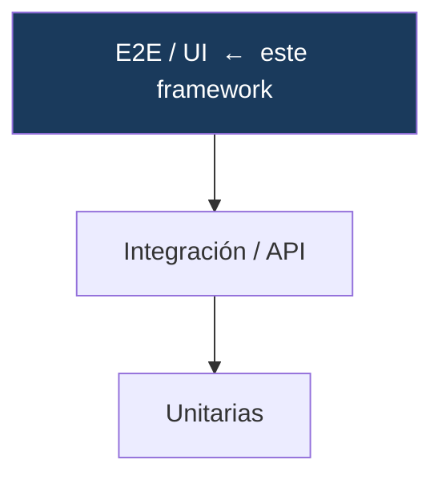

# Framework de Automatización E2E — Playwright + TypeScript

Framework de automatización de pruebas **end-to-end** para aplicaciones web, construido con **Playwright** y **TypeScript** sobre una arquitectura por capas: **Page Object Model** con componentes reutilizables, fixtures, datos desacoplados y ejecución **cross-browser**.


---

## Resumen ejecutivo

| | |
|---|---|
| **Qué es** | Un framework E2E mantenible y escalable para validar flujos de negocio completos a través de la interfaz, como lo haría un usuario real. |
| **Problema que resuelve** | Las suites de UI tienden a volverse frágiles e inmantenibles. Este framework encapsula los detalles de la interfaz para que los cambios de UI no rompan los tests, y valida **lógica de negocio real**, no solo la presencia de elementos. |
| **Alcance de la demo** | Flujo de e-commerce completo: autenticación, catálogo, ordenamiento, carrito y checkout con verificación de cálculo de totales. |
| **Resultado** | 13 casos ejecutándose en 3 navegadores (39 ejecuciones) en segundos, con verificación de tipos estricta e integración continua. |
| **Stack** | Playwright · TypeScript (`strict`) · GitHub Actions |

---

## Arquitectura



**Principio rector:** separación de responsabilidades. Los tests hablan de negocio (`loginPage.login(user)`) y no conocen ningún selector; toda la mecánica de interacción vive en los Page Objects. Cuando la UI cambia, se ajusta una capa y los tests quedan intactos.

### Posición en la estrategia de testing



Este framework cubre la capa E2E: los flujos críticos que deben validarse de punta a punta. La lógica de negocio granular se cubre en capas inferiores (más rápidas y estables).

---

## Capacidades técnicas

| Capacidad | Implementación |
|---|---|
| **Page Object Model** | Cada pantalla es una clase que encapsula localizadores y acciones |
| **Componentes reutilizables** | `HeaderComponent` compartido por composición entre páginas |
| **Fixtures** | Inyección de Page Objects lista para usar; construcción *lazy* |
| **Data-Driven Testing** | Casos de login parametrizados desde datos |
| **Verificación de negocio** | El checkout valida que `Total = subtotal + impuesto` |
| **Aserciones web-first** | Auto-wait; sin esperas fijas (`waitForTimeout`) |
| **Configuración por ambiente** | `baseURL` inyectada por variable de entorno |
| **Cross-browser** | Chromium, Firefox y WebKit |
| **Type safety** | `strict: true`; verificación de tipos en CI |

---

## Estructura

```
src/
├── config/env.ts              # baseURL desde variable de entorno
├── data/                      # usuarios + builder de datos de checkout
├── components/HeaderComponent.ts
├── pages/                     # BasePage + Page Objects por pantalla
└── fixtures/pages.fixture.ts  # fixtures que inyectan los Page Objects
tests/
├── auth/  inventory/  cart/  checkout/   # tests por funcionalidad
```

---

## Uso

```bash
npm install
npx playwright install

npm test                 # suite completa, 3 navegadores
npm run test:chromium    # solo Chromium (desarrollo rápido)
npm run test:ui          # modo UI interactivo
npm run test:smoke       # solo tests críticos (@smoke)
npm run typecheck        # verificación de tipos
npm run report           # reporte HTML (con trace viewer)
```

Configuración por ambiente:

```bash
BASE_URL=https://staging.ejemplo.com npm test
```

---

## Documentación técnica

**[docs/DOCUMENTACION-TECNICA.md](docs/DOCUMENTACION-TECNICA.md)** detalla el diseño y las decisiones: elección de herramienta, Page Object Model, composición vs herencia, fixtures, estrategia de localizadores, manejo de esperas y ejecución cross-browser.

---

## La suite completa

Este repositorio forma parte de una suite de automatización de calidad que cubre el ciclo de testing de punta a punta, de los fundamentos a las prácticas propias de un rol SDET.

**Fundamentos**

1. **Framework E2E de UI** — este repositorio
2. [Testing de API](https://github.com/fercarballo/api-testing-framework-restful-booker) — contract testing con Zod
3. [Pipeline CI/CD](https://github.com/fercarballo/qa-automation-cicd-pipeline) — GitHub Actions · quality gates
4. [Estabilidad y flakiness](https://github.com/fercarballo/flakiness-hunting-playwright) — detección y erradicación
5. [Regresión visual & contract testing](https://github.com/fercarballo/visual-and-contract-testing) — Playwright + Pact

**Avanzado (SDET)**

6. [Performance & load testing](https://github.com/fercarballo/performance-testing-k6) — k6 · thresholds como gate
7. [Integración con dependencias reales](https://github.com/fercarballo/integration-testing-testcontainers) — Testcontainers · Postgres
8. [DevSecOps](https://github.com/fercarballo/devsecops-pipeline) — SAST · SCA · DAST en el pipeline
9. [Tooling interno de QA](https://github.com/fercarballo/qa-insights) — test impact + flaky detection
10. [Evals de aplicaciones con IA](https://github.com/fercarballo/llm-evals-harness) — LLM testing

---

## Licencia

MIT.
